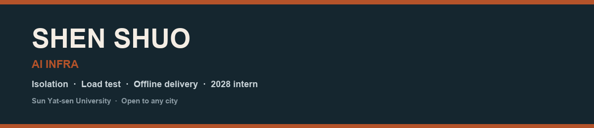

  

  
  
  
  

  

中山大学信息管理与信息系统 **2028 届**。暑期在 **华为 2012 实验室** 做鲲鹏 ARM64 离线代码执行沙箱：选型、隔离配额、并发压测、残留排查。应用能写，主线是 Infra。

**城市不限。** 这学期可 3 天，寒假可集中，暑假可全勤。

---

## 置顶：Infra

<table>
<tr>
<td width="50%" valign="top">

### 🟠 [sandbench](https://github.com/shenshuo-maker/sandbench)

隔离容器执行 + 创建/执行/销毁压测。

- 配额：CPU / 内存 / PID / 无网
- 失败分类：ok · timeout · oom · error
- 超时强制回收，bench 后 leftover = 0

</td>
<td width="50%" valign="top">

### 🔵 华为 2012 · AI Infra 实习

2026.07 – 2026.09 · 杭州（内网，代码不公开）

- ARM64 + openEuler 离线沙箱落地
- 50 / 500 梯度压测与故障 SOP
- 评测底座上的知识库模块（配套）

公开练习就是左边的 **sandbench**。

</td>
</tr>
</table>

## 其它仓库（应用向，Infra 面试请先看上面）

| 仓库 | 一句话 | 栈 |
| --- | --- | --- |
| [algorithm-check-system](https://github.com/shenshuo-maker/algorithm-check-system) | 省级大创：算法备案文本合规检测 | BERT · FastAPI · Vue |
| [smart-doc-platform](https://github.com/shenshuo-maker/smart-doc-platform) | 文档 RAG + ReAct，评测场景的知识库练习 | LangChain · Chroma |
| [fin-research-ai](https://github.com/shenshuo-maker/fin-research-ai) | 科研辅助平台：鉴权、脱敏、Compose 部署 | Spring Boot · Vue3 |
| [lead-flow-lite](https://github.com/shenshuo-maker/lead-flow-lite) | 获客演示；无 Key 自动降级 | React · Flask |

## 竞赛

 

## 联系

📧 [abc300739@qq.com](mailto:abc300739@qq.com)　·　GitHub 即本页

  
  

